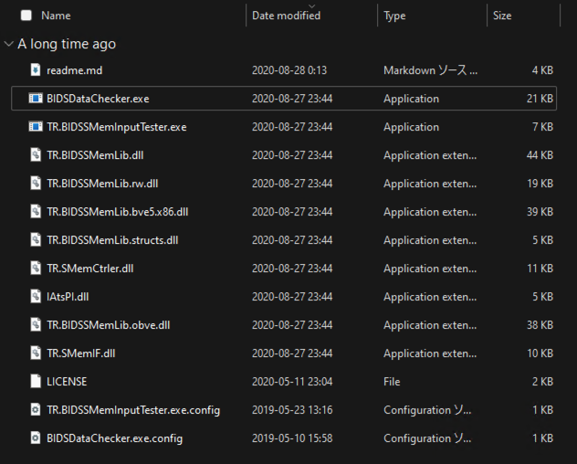

# How to install BIDSSMemLib

- [BVE5にインストールする方はこちら](#bve5)
- [BVE6にインストールする方はこちら](#bve6)
- [openBVEにインストールする方はこちら](#openbve)
- [ソフトウェア開発に使用する方はこちら](#ソフトウェア開発に使用する)

## BVE5

前提として、BVE5の本体はインストール済みであり、シナリオや車両データも準備済みとします。
今回は、インストール先のシナリオ例として、[「BVE Trainsim 内房線」](http://bvets.net/uchibo/)を使用します。

### 1. BIDSSMemLibをダウンロードする

まずは、プラグインをダウンロードします。[BIDSSMemLibのReleasesページ](https://github.com/Tralsys/BIDSSMemLib/releases/latest)を開いて下さい。

おそらく上の画像のようなページが表示されたのではないでしょうか? (赤い枠は説明用に描いたもので、実際には表示されません)  
(表示内容は、記事作成時点のLatest版のものです。今後新しいバージョンをリリースした場合、タイトルや本文等は画像のものと違うものになります。)

このページの下部、赤枠で囲った「Assets」というところからプラグインをダウンロードします。

今回はBVE5向けなので、「x86」版をダウンロードします。`***.x86.zip`をクリックし、ダウンロードして下さい。
このページで言うと、`BIDSSMemLib.v202_1.x86.zip`ですね。このファイル名はリリースごとに変わるので、ご了承ください。

(7z圧縮も用意していますが、解凍方法のサポートはしません)

### 2. ダウンロードしたファイルを解凍する

ダウンロードしたファイルは圧縮されているので、これを解凍します。
ダウンロードしたZIPファイルを右クリックし、「全て解凍」(`Extract All`)を選択して下さい。

あるいは、解凍せずにZIPファイルをダブルクリックしても構いません。

ZIPファイルを解凍した方は、解凍先のフォルダを開いて下さい。
ダブルクリックで開いた方は、このままお読み下さい。

おそらく、上の画像のように様々なファイルが並んでいるのではないでしょうか?

この中から、今回は`TR.BIDSSMemLib.bve5.x86.dll`を使用しますが、とりあえず一旦この作業はここまでです。

### 3. BVE5の実行ファイルを見つける

### 4. 入力デバイスプラグインフォルダにdllをコピーする

### 5. 入力デバイスプラグインとして有効化する

### 6. 動作チェック (操作入力)

### 7. Scenarioファイルを確認する

### 8. Vehicleファイルを確認する

### 9. ATSプラグインのフォルダにdllをコピーする

### 10. `detailmodules.txt`にdllを追記する

### 11. シナリオをBVEで読み込む

### 12. 動作チェック (情報出力)

## BVE6

前提として、BVE6の本体はインストール済みであり、シナリオや車両データも準備済みとします。
今回は、インストール先のシナリオ例として、[「BVE Trainsim 内房線」](http://bvets.net/uchibo/)を使用します。

### 1. BIDSSMemLibをダウンロードする

まずは、プラグインをダウンロードします。[BIDSSMemLibのReleasesページ](https://github.com/Tralsys/BIDSSMemLib/releases/latest)を開いて下さい。

おそらく上の画像のようなページが表示されたのではないでしょうか? (赤い枠は説明用に描いたもので、実際には表示されません)  
(表示内容は、記事作成時点のLatest版のものです。今後新しいバージョンをリリースした場合、タイトルや本文等は画像のものと違うものになります。)

このページの下部、赤枠で囲った「Assets」というところからプラグインをダウンロードします。

今回はBVE6向けなので、「x64」版をダウンロードします。`***.x64.zip`をクリックし、ダウンロードして下さい。
このページで言うと、`BIDSSMemLib.v202_1.x64.zip`ですね。このファイル名はリリースごとに変わるので、ご了承ください。

(7z圧縮も用意していますが、解凍方法のサポートはしません)

### 2. ダウンロードしたファイルを解凍する

ダウンロードしたファイルは圧縮されているので、これを解凍します。
ダウンロードしたZIPファイルを右クリックし、「全て解凍」(`Extract All`)を選択して下さい。

あるいは、解凍せずにZIPファイルをダブルクリックしても構いません。

ZIPファイルを解凍した方は、解凍先のフォルダを開いて下さい。
ダブルクリックで開いた方は、このままお読み下さい。

おそらく、上の画像のように様々なファイルが並んでいるのではないでしょうか?

この中から、今回は`TR.BIDSSMemLib.bve5.x64.dll`を使用しますが、とりあえず一旦この作業はここまでです。

### 3. BVE6の実行ファイルを見つける

### 4. 入力デバイスプラグインフォルダにdllをコピーする

### 5. 入力デバイスプラグインとして有効化する

### 6. 動作チェック (操作入力)

### 7. Scenarioファイルを確認する

### 8. Vehicleファイルを確認する

### 9. ATSプラグインのフォルダにdllをコピーする

### 10. `detailmodules.txt`にdllを追記する

### 11. シナリオをBVEで読み込む

### 12. 動作チェック (情報出力)

## openBVE

準備中

## ソフトウェア開発に使用する

準備中
