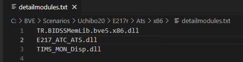

# How to install BIDSSMemLib

BIDSSMemLibをインストールする方法を解説しています。
なお、エクスプローラや、コピー&ペーストなど、PCの基本的な語句や操作はご存知のものとして解説しています。

- [BVE5にインストールする方はこちら](#bve5)
- [BVE6にインストールする方はこちら](#bve6)
- [openBVEにインストールする方はこちら](#openbve)
- [ソフトウェア開発に使用する方はこちら](#ソフトウェア開発に使用する)

## BVE5

前提として、BVE5の本体はインストール済みであり、シナリオや車両データも準備済みとします。
今回は、インストール先のシナリオ例として、[「BVE Trainsim 内房線」](http://bvets.net/uchibo/)を使用します。

### 1. BIDSSMemLibをダウンロードする

まずは、プラグインをダウンロードします。[BIDSSMemLibのReleasesページ](https://github.com/Tralsys/BIDSSMemLib/releases/latest)を開いて下さい。

おそらく上の画像のようなページが表示されたのではないでしょうか? (赤い枠は説明用に描いたもので、実際には表示されません)  
(表示内容は、記事作成時点のLatest版のものです。今後新しいバージョンをリリースした場合、タイトルや本文等は画像のものと違うものになります。)

このページの下部、赤枠で囲った「Assets」というところからプラグインをダウンロードします。

今回はBVE5向けなので、「x86」版をダウンロードします。`***.x86.zip`をクリックし、ダウンロードして下さい。
このページで言うと、`BIDSSMemLib.v202_1.x86.zip`ですね。このファイル名はリリースごとに変わるので、ご了承ください。

(7z圧縮も用意していますが、解凍方法のサポートはしません)

### 2. ダウンロードしたファイルを解凍する

ダウンロードしたファイルは圧縮されているので、これを解凍します。
ダウンロードしたZIPファイルを右クリックし、「全て解凍」(`Extract All`)を選択して下さい。

あるいは、解凍せずにZIPファイルをダブルクリックしても構いません。

ZIPファイルを解凍した方は、解凍先のフォルダを開いて下さい。
ダブルクリックで開いた方は、このままお読み下さい。

おそらく、上の画像のように様々なファイルが並んでいるのではないでしょうか?

この中から、今回は`TR.BIDSSMemLib.bve5.x86.dll`を使用しますが、とりあえず一旦この作業はここまでです。
このエクスプローラウィンドウを開いたままで、次の手順に進みます。

### 3. BVE5の実行ファイルを見つける

新しいエクスプローラのウィンドウ(あるいはタブ)を開き、BVEの実行ファイルを探します。

インストーラを使用してインストールした場合、BVEの実行ファイルは次の場所にあります。

[`C:\Program Files (x86)\mackoy\BveTs5\BveTs.exe`](file://C:/Program Files (x86)/mackoy/BveTs5)

ZIPファイルを解凍して配置した場合は違う場所にあるかもしれませんが、その場合は自力で見つけて下さい。

上の画像のようなファイル群を見つけることが出来たら成功です。

### 4. 入力デバイスプラグインフォルダにdllをコピーする

BVEの実行ファイルと同じフォルダにある `Input Devices` フォルダを開き、そこに手順2で入手した `TR.BIDSSMemLib.bve5.x86.dll` をコピペします。

上の画像のように、`Input Devices`フォルダ内に`TR.BIDSSMemLib.bve5.x86.dll`があればOKです。

### 5. 入力デバイスプラグインとして有効化する

手順4で使用したフォルダの一つ上のフォルダ、つまり手順3で見つけたフォルダを開き、そこにある`BveTs.exe`をダブルクリックして実行します。

BVEを実行すると、まずシナリオ選択ウィンドウが出てきますが、それは一旦閉じて、BVEのメインウィンドウを開いた状態にします。
そして、BVEのメインウィンドウ内で右クリックし、「設定」という項目をクリックします。

「設定」をクリックすると、「設定」ウィンドウが出るので、そこで「入力デバイス」タブを選択します。

若干表示が違う可能性もありますが、概ね上の画像のような表示を確認できると思います。

「追加の入力デバイス」エリアに、「BIDS Project」という表示があるはずなので、それをダブルクリックするなり、左にチェックを入れるなりして、とにかく有効にします。

「追加の入力デバイス」エリア下部にある「プロパティー」ボタンを押下して、上の画像のような表示を得ることができたら成功です。

ここまで成功することで、BVEに対してマスコン等の操作を入力することが可能になります。

(当たり前ですが、ここのチェックを外すとBIDSの操作入力が無効化されます。再度チェックを入れることで再び有効化されます。)

### 6. 動作チェック (操作入力)

ここで一旦動作確認を行います。
手順5で開いた設定ウィンドウを閉じ、そのまま適当なシナリオを開きます。
正常に開けるシナリオであれば、どのようなシナリオでも構いません。

次に、手順2で開いていたエクスプローラに戻り、`TR.BIDSSMemInputTester.exe`を開きます。

あとは、Input Testerにてコマンドを打ち、その通りにBVE側のハンドル状態が変化すれば成功です。

例えば、上のスクショの状態で `R1 B0 P4 D0` というコマンドを打つと、「レバーサー前、(ブレーキ0段)、力行4段」のハンドル位置をとったうえで、汽笛が鳴り続けます。
汽笛は、`U0`というコマンドを打つことで停止します。

なお、可能な操作は以下の通りです。

|コマンド|コマンド例|例の意味|
|:---:|:---:|:---|
|`Pxxx`|`P-1`|力行ハンドルを「-1段」に設定する (通常は抑速段)|
|`Bxxx`|`B2`|制動ハンドルを「2段」に設定する|
|`Rxxx`|`R1`|レバーサーを「前」に設定する (1:前、0:中、-1:後)|
|`Dxxx`|`D1`|キー1を押下する|
|`Uxxx`|`U2`|キー2の押下状態を解除する|

なお、キー番号とキーの対照は次の通りです。

|番号|キー名|
|:---:|:---:|
|0|Horn 1|
|1|Horn 2|
|2|Music Horn|
|3|定速|
|4|ATS_S|
|5|ATS_A1|
|6|ATS_A2|
|7|ATS_B1|
|8|ATS_B2|
|9|ATS_C1|
|10|ATS_C2|
|11|ATS_D|
|12|ATS_E|
|13|ATS_F|
|14|ATS_G|
|15|ATS_H|
|16|ATS_I|
|17|ATS_J|
|18|ATS_K|
|19|ATS_L|

操作可能なことが確認できたら、一旦BVEもInput Testerも閉じて構いません。

### 7. Scenarioファイルを確認する

さて、ここから情報出力側についてインストールしていきます。

情報を出力するプラグインは、使用したいすべての車両にインストールする必要があります。

まずは、インストールする車両を確認するため、Scenarioファイルを確認します。
インストールする車両のVehicleファイルがわかっているのであれば、この手順は省略して構いません。
手順4で使用していたエクスプローラウィンドウを使用して、Scenarioファイルを開いて下さい。

Scenarioファイルを開くと、`Vehicle`セクションがあるので、そこに書かれているVehicleファイルの場所に移動します。

### 8. Vehicleファイルを確認する

Vehicleファイルを開くと、`Ats32`セクション (または`Ats`セクション)が存在すると思います。
そこに`DetailManager.dll`へのパスが書かれていることを確認して下さい。

DetailManager以外が指定されている場合は、DetailManagerの導入が必要になります。
DetailManagerの導入方法まではサポートできませんので、ご了承ください。

### 9. ATSプラグインのフォルダにdllをコピーする

`DetailManager.dll`が存在するディレクトリを開き、そこに手順2で確認した`TR.BIDSSMemLib.bve5.x86.dll`をコピペします。

### 10. `detailmodules.txt`にdllを追記する

DetailManagerは、`detailmodules.txt`から読み込むプラグインを決定します。
そこで、`detailmodules.txt`の先頭行に`TR.BIDSSMemLib.bve5.x86.dll`と挿入します。

E217系の場合は、上の画像のようになります。

### 11. シナリオをBVEで読み込む

最後に、動作確認を行います。

手順7で確認したScenarioファイル (あるいは、手順8で確認したVehicleを使用するScenarioファイル) を、BVEで開いて下さい。

### 12. 動作チェック (情報出力)

手順2で開いていたフォルダに `BIDSDataChecker.exe`というソフトがあるので、それを起動して下さい。

BVEでの状態情報がDataCheckerにも表示されていたら、インストール成功です。
お疲れさまでした

## BVE6

前提として、BVE6の本体はインストール済みであり、シナリオや車両データも準備済みとします。
今回は、インストール先のシナリオ例として、[「BVE Trainsim 内房線」](http://bvets.net/uchibo/)を使用します。

説明に使用している画像について、一部BVE5を使用しているものがありますが、UI的にはBVE6とほぼ同じなので、特に気にせずにご覧ください。
気が向いたらBVE6を使用したものに差し替えます。

### 1. BIDSSMemLibをダウンロードする

まずは、プラグインをダウンロードします。[BIDSSMemLibのReleasesページ](https://github.com/Tralsys/BIDSSMemLib/releases/latest)を開いて下さい。

おそらく上の画像のようなページが表示されたのではないでしょうか? (赤い枠は説明用に描いたもので、実際には表示されません)  
(表示内容は、記事作成時点のLatest版のものです。今後新しいバージョンをリリースした場合、タイトルや本文等は画像のものと違うものになります。)

このページの下部、赤枠で囲った「Assets」というところからプラグインをダウンロードします。

今回はBVE6向けなので、「x64」版をダウンロードします。`***.x64.zip`をクリックし、ダウンロードして下さい。
このページで言うと、`BIDSSMemLib.v202_1.x64.zip`ですね。このファイル名はリリースごとに変わるので、ご了承ください。

(7z圧縮も用意していますが、解凍方法のサポートはしません)

### 2. ダウンロードしたファイルを解凍する

ダウンロードしたファイルは圧縮されているので、これを解凍します。
ダウンロードしたZIPファイルを右クリックし、「全て解凍」(`Extract All`)を選択して下さい。

あるいは、解凍せずにZIPファイルをダブルクリックしても構いません。

ZIPファイルを解凍した方は、解凍先のフォルダを開いて下さい。
ダブルクリックで開いた方は、このままお読み下さい。

おそらく、上の画像のように様々なファイルが並んでいるのではないでしょうか?

この中から、今回は`TR.BIDSSMemLib.bve5.x64.dll`を使用しますが、とりあえず一旦この作業はここまでです。
このエクスプローラウィンドウを開いたままで、次の手順に進みます。

### 3. BVE6の実行ファイルを見つける

新しいエクスプローラのウィンドウ(あるいはタブ)を開き、BVEの実行ファイルを探します。

インストーラを使用してインストールした場合、BVEの実行ファイルは次の場所にあります。

[`C:\Program Files\mackoy\BveTs5\BveTs.exe`](file://C:/Program Files/mackoy/BveTs6)

ZIPファイルを解凍して配置した場合は違う場所にあるかもしれませんが、その場合は自力で見つけて下さい。

上の画像のようなファイル群を見つけることが出来たら成功です。

### 4. 入力デバイスプラグインフォルダにdllをコピーする

BVEの実行ファイルと同じフォルダにある `Input Devices` フォルダを開き、そこに手順2で入手した `TR.BIDSSMemLib.bve5.x64.dll` をコピペします。

(画像準備中  上の画像はBVE5のものです)

上の画像のように、`Input Devices`フォルダ内に`TR.BIDSSMemLib.bve5.x64.dll`があればOKです。

### 5. 入力デバイスプラグインとして有効化する

手順4で使用したフォルダの一つ上のフォルダ、つまり手順3で見つけたフォルダを開き、そこにある`BveTs.exe`をダブルクリックして実行します。

BVEを実行すると、まずシナリオ選択ウィンドウが出てきますが、それは一旦閉じて、BVEのメインウィンドウを開いた状態にします。
そして、BVEのメインウィンドウ内で右クリックし、「設定」という項目をクリックします。

「設定」をクリックすると、「設定」ウィンドウが出るので、そこで「入力デバイス」タブを選択します。

若干表示が違う可能性もありますが、概ね上の画像のような表示を確認できると思います。

「追加の入力デバイス」エリアに、「BIDS Project」という表示があるはずなので、それをダブルクリックするなり、左にチェックを入れるなりして、とにかく有効にします。

「追加の入力デバイス」エリア下部にある「プロパティー」ボタンを押下して、上の画像のような表示を得ることができたら成功です。

ここまで成功することで、BVEに対してマスコン等の操作を入力することが可能になります。

(当たり前ですが、ここのチェックを外すとBIDSの操作入力が無効化されます。再度チェックを入れることで再び有効化されます。)

### 6. 動作チェック (操作入力)

ここで一旦動作確認を行います。
手順5で開いた設定ウィンドウを閉じ、そのまま適当なシナリオを開きます。
正常に開けるシナリオであれば、どのようなシナリオでも構いません。

次に、手順2で開いていたエクスプローラに戻り、`TR.BIDSSMemInputTester.exe`を開きます。

あとは、Input Testerにてコマンドを打ち、その通りにBVE側のハンドル状態が変化すれば成功です。

例えば、上のスクショの状態で `R1 B0 P4 D0` というコマンドを打つと、「レバーサー前、(ブレーキ0段)、力行4段」のハンドル位置をとったうえで、汽笛が鳴り続けます。
汽笛は、`U0`というコマンドを打つことで停止します。

なお、可能な操作は以下の通りです。

|コマンド|コマンド例|例の意味|
|:---:|:---:|:---|
|`Pxxx`|`P-1`|力行ハンドルを「-1段」に設定する (通常は抑速段)|
|`Bxxx`|`B2`|制動ハンドルを「2段」に設定する|
|`Rxxx`|`R1`|レバーサーを「前」に設定する (1:前、0:中、-1:後)|
|`Dxxx`|`D1`|キー1を押下する|
|`Uxxx`|`U2`|キー2の押下状態を解除する|

なお、キー番号とキーの対照は次の通りです。

|番号|キー名|
|:---:|:---:|
|0|Horn 1|
|1|Horn 2|
|2|Music Horn|
|3|定速|
|4|ATS_S|
|5|ATS_A1|
|6|ATS_A2|
|7|ATS_B1|
|8|ATS_B2|
|9|ATS_C1|
|10|ATS_C2|
|11|ATS_D|
|12|ATS_E|
|13|ATS_F|
|14|ATS_G|
|15|ATS_H|
|16|ATS_I|
|17|ATS_J|
|18|ATS_K|
|19|ATS_L|

操作可能なことが確認できたら、一旦BVEもInput Testerも閉じて構いません。

### 7. Scenarioファイルを確認する

さて、ここから情報出力側についてインストールしていきます。

情報を出力するプラグインは、使用したいすべての車両にインストールする必要があります。

まずは、インストールする車両を確認するため、Scenarioファイルを確認します。
インストールする車両のVehicleファイルがわかっているのであれば、この手順は省略して構いません。
手順4で使用していたエクスプローラウィンドウを使用して、Scenarioファイルを開いて下さい。

Scenarioファイルを開くと、`Vehicle`セクションがあるので、そこに書かれているVehicleファイルの場所に移動します。

### 8. Vehicleファイルを確認する

Vehicleファイルを開くと、`Ats64`セクションが存在すると思います。
そこに`DetailManager.dll`へのパスが書かれていることを確認して下さい。

DetailManager以外が指定されている場合は、DetailManagerの導入が必要になります。
DetailManagerの導入方法まではサポートできませんので、ご了承ください。

### 9. ATSプラグインのフォルダにdllをコピーする

`DetailManager.dll`が存在するディレクトリを開き、そこに手順2で確認した`TR.BIDSSMemLib.bve5.x64.dll`をコピペします。

### 10. `detailmodules.txt`にdllを追記する

DetailManagerは、`detailmodules.txt`から読み込むプラグインを決定します。
そこで、`detailmodules.txt`の先頭行に`TR.BIDSSMemLib.bve5.x64.dll`と挿入します。

(画像準備中  上の画像はBVE5のものです)

E217系の場合は、上の画像のようになります。

### 11. シナリオをBVEで読み込む

最後に、動作確認を行います。

手順7で確認したScenarioファイル (あるいは、手順8で確認したVehicleを使用するScenarioファイル) を、BVEで開いて下さい。

### 12. 動作チェック (情報出力)

手順2で開いていたフォルダに `BIDSDataChecker.exe`というソフトがあるので、それを起動して下さい。

BVEでの状態情報がDataCheckerにも表示されていたら、インストール成功です。
お疲れさまでした

## openBVE

準備中

## ソフトウェア開発に使用する

準備中
