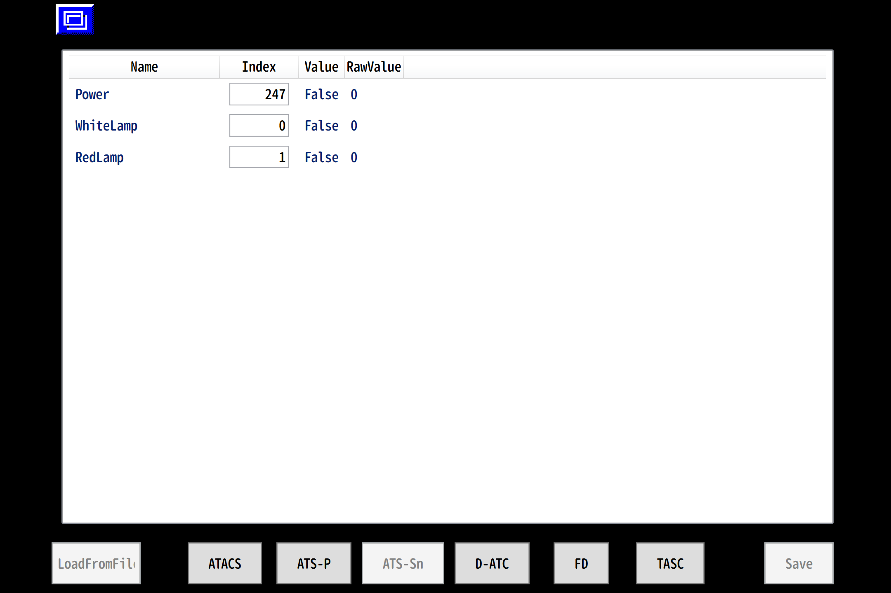

# caMonPageMod HoanDisp 使い方
本modを読み込むと, 最初に選択ページが表示されます.  この画面より表示したいページを選択します.

## 設定画面 使い方
例として, ATS-Sn表示灯の設定画面を使用します.

選択ページから移動した直後はリストに何も表示されていませんが, ページ下部「ATS-Sn」ボタンを押下することで上記例と同じような表示が出るかと思われます.

リストヘッダは, 以下の4つです
- Name : 変数名
- Index : 表示灯の点灯状態が格納されたPanelインデックス
- Value : 点灯状態として判断されているか否か
- RawValue : 現在のPanel値

Index列に存在するTextBoxにある値を変更することにより, リアルタイムでインデックス対応が変化します.  
なお, Indexに0未満や256以上等, 値を取得できない範囲を指定された場合, 表示灯は常に消灯状態, つまりValueが常にFalseとなります.  
これを使用し, 対応indexが見当たらない表示灯のIndexデフォルト値を-1としています.

## 表示灯表示とNameの対応関係
### ATACS

|Name|実際の表示灯表示|
|-|-|
|Power|ATACS電源|
|CutOut|ATACS開放|
|ATACS|ATACS|
|Off|切|
|NormalBrake|ATACS常用|
|EmergencyBrake|ATACS非常|
|MisspassingPreventer|停通防止動作|
|RollbackDetected|後退検知|
|LowerPattern|パターン低減|
|EmergencyOperation|非常運転|
|IDLinked|(ID結合)|
|CarIDFault|車上ID故障|
|Fault|ATACS故障|
|System1Fault|1系故障|
|System2Fault|2系故障|

### ATS-P

|Name|実際の表示灯表示|
|-|-|
|Power|P電源|
|PatternOnComing|パターン接近|
|NormalBrake|常用ブレーキ|
|EmergencyBrake|非常ブレーキ|
|BrakeCutOut|ブレーキ開放|
|ATSP|ATS-P|
|Fault|故障|

### ATS-Sn

|Name|実際の表示灯表示|
|-|-|
|Power|(ATS電源)|
|WhiteLamp|ATS電源|
|RedLamp|ATS動作|

### D-ATC

|Name|実際の表示灯表示|
|-|-|
|DATC|デジタルATC|
|ATC|ATC|
|Off|切|
|LowerPattern|パターン低減|
|EmergencyOperation|非常運転|
|NormalBrake|ATC常用|
|EmergencyBrake|ATC非常|
|MisspassingPreventer|停通防止動作|
|Power|ATC電源|
|CutOut|ATC開放|

### FD

|Name|実際の表示灯表示|
|-|-|
|RollingStopBrake|転動防止ブレーキ|
|JustPoint|定位置|
|CarDoorAllClosed|車両ドア全閉|
|FDAllClosed|ホームドア全閉|
|SystemConnected|ホームドア連携|
|SystemDisconnected|ホームドア分離|
|SystemCutOut|ホームドア開放|

### TASC

|Name|実際の表示灯表示|
|-|-|
|Power|TASC電源|
|Pattern|TASCパターン|
|Brake|TASCブレーキ|
|Off|TASC切|
|Fault|TASC故障|
|Inching|インチング制御中|
