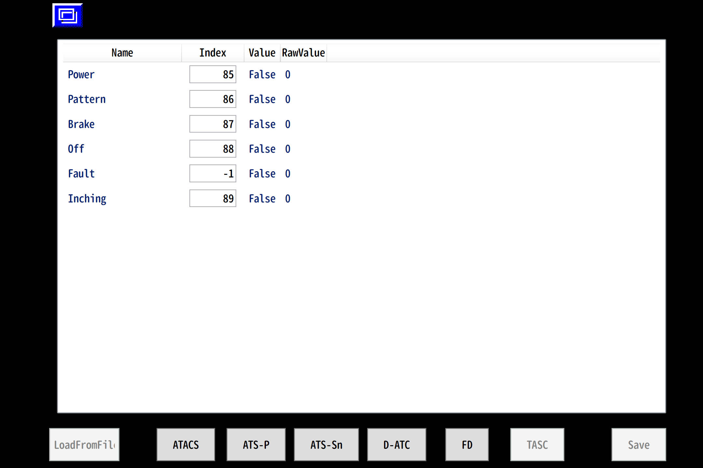

# HoanDisp Page List
なお, 各画像には開発中版のものが含まれている場合があります.  実際の表示とは異なる場合がありますので, ご了承ください.

## ページ構造

## ページ一覧
### トップページ(ページ選択画面)

### 設定画面
#### 初期状態

#### ATS-P

#### ATS-Sn

#### D-ATC

#### FD

#### TASC

### 保安灯画面
#### ATS-P

#### ATS-P + TASC/FD

#### ATS-P + Sn

#### ATS-P + Sn + TASCFD

#### D-ATC

#### D-ATC + TASCFD

#### ATACS

#### ATACS + TASCFD

